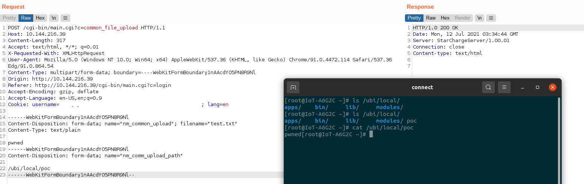

# Overview
Authenticated Remote Code Execution via web interface (CGI).

# Product and Version
Product | Affected | Mitigated
---|---|---
Nova 360 Cabinet | <= 1.3.0.0.7b102 | Beta1.3.0.1.0
Titan 180 Premium | <= 1.3.0.0.6 | 1.3.0.0.9  

# Description
A directory traversal vulnerability in web application (`main.cgi`), allow any authenticated user to upload arbitrary file into server, lead to remote code execution.

